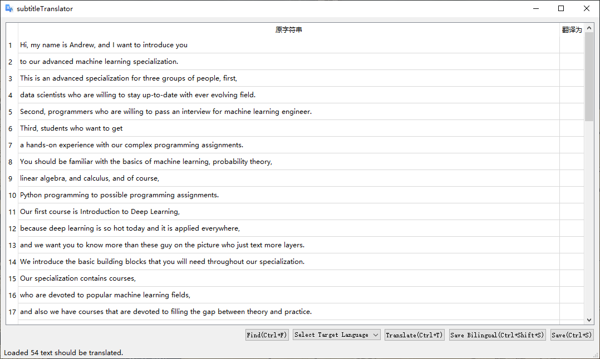
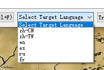
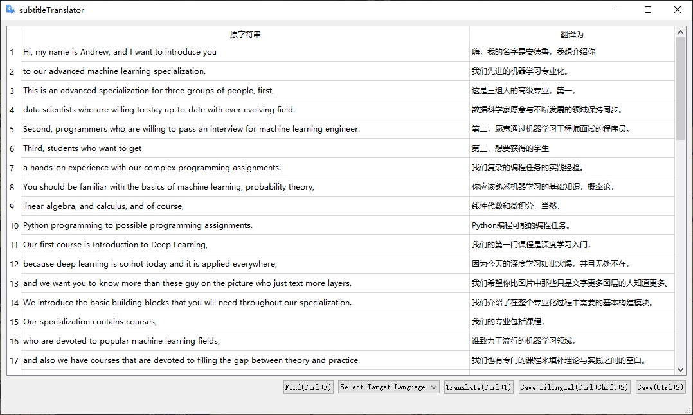

# subtitle translator


srt 字幕翻译软件，翻译功能由谷歌翻译实现。
translate SubRip (.srt) to anyone language, powered by Google Translate.

[Project Home Page](http://coolwp.com/subtitle-translator.html)


## UI

load a srt file



choose a traget language for translation, or it will be simplified-Chinese



translated




## Release

[V1.0.0](./releases/)

## Source Code

[the initial version code ](./src)

## Softwares Used

```

eric6
Qt Designer


```

## Dependent Python packages
```

pip install PyQt5 fbs requests pysrt  googletrans

```

## 快捷键的使用/ shortcuts

Ctrl+F : Find and open a SubRip (.srt) file；

Ctrl+T: the current subtitle file will be translate to the selected language, if no language is selected simplified-Chinese by default .

Ctrl+S : save the translated subtitle file;

Ctrl+Alt+S : save as a bilingual subtitle file.


## Versions

1.0.0 : init;
